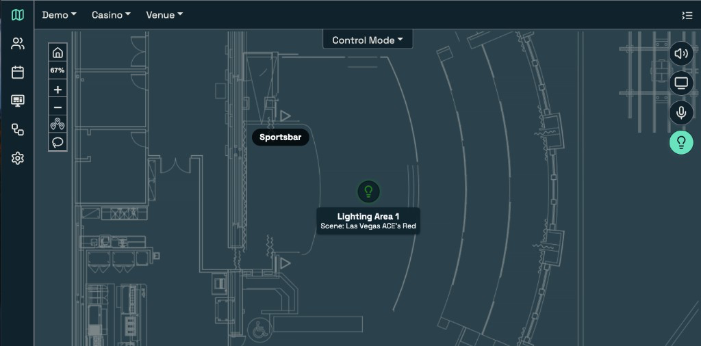

# Lighting lives with the rest of the A/V

Guests read a room as one environment. Lighting, displays, and audio land together, and any change in one changes how the whole space feels.

Operations often has to run that environment on separate control paths, with lighting on its own console and the rest of the A/V somewhere else. Staff have to leave the main interface, work another system, and manually keep the lighting look in step with display and audio changes. When that coordination slips, the room does not change as one room. It changes in pieces.

LUCI brings lighting into the same interface as displays, audio, and sources. Your staff can call a lighting look, select the zone that needs attention, and adjust levels in context with the rest of the room. LUCI does not replace lighting. It works with and absorbs the systems already on the floor, so lighting joins the wider A/V operation instead of staying on a separate console.

*Lighting looks and zones sit on the same map as the rest of the floor.*

That matters most during live room changes. When a space moves from everyday programming to an event, staff can:

1. call the lighting look for the room;
2. switch displays to the event source; and
3. put the audio zones in the required state.

Each system still performs its own job. The change is operational: staff run it from one interface, in the order the guest experience requires.

For A/V, IT, and operations leaders, the question shifts from "Who is running each system tonight?" to "What should the room do?" A walkthrough starts with the lighting and A/V already in the building: the looks you use now, the rooms and zones your staff operate, the display and audio states tied to them, and the console handoffs you want to remove.

Book a walkthrough to see lighting join the same operational map as the rest of the floor.

---
Source brief: spotlight-lighting.md
